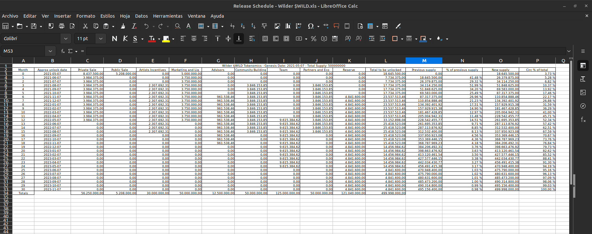

# Distribution-Schedule

This script computes the full distribution schedule (for a linear release scheme) of tokens given the usual data teams provide for this.

The purpose is to facilitate researchers their work, making the task of running the numbers from tokenomics data to the actual detailed schedule fast and simple.

Use: There are two ways to provide information: from a text file (recommended, it is easier to modify if needed) and manually (you will be prompted to input all details), for any choice you have to provide:

First, basic information:
1. Name of the token [string]
2. Maximum Supply
3. Total supply [comma separator is allowed]
4. Number of categories for the allocation [int]

Then, the specifics for each category:
1. Name of the category [example: Public Sale]
2. Percentage of TOTAL SUPPLY for this category [example: 10.5% or 10.5, both are valid]
3. Percentage of tokens FOR THIS CATEGORY unlocked at genesis (i.e. immediatly unlocked, can be zero; if all tokens are unlocked at genesis, introduce 100)
4. Initial lock period in months (can be zero) [example: 3.5]
5. Periodicity for unlocks in months (can be zero if all tokens are released after locking period) [example: 12 if tokens are released one time per year, 1 if tokens are released monthly]
6. Total unlock length in months NOT including the locking period (can be zero if all tokens are released after locking period) [example: 3*12 if tokens of this category are released on a 3 year horizon NOT including the initial locking period]

Check BaseDatafile.txt and WilderExample.txt to understand how to incorporate the data correctly.

We provide a real-example computation (WilderExample.txt and the output from this script 'Release Schedule - Wilder $WILD.xls') from Wilder World $WILD token whose lack of details on tokenomics inspired this work! the numbers are taken from [here](https://miro.medium.com/max/640/0*lAExBtTYVuYcCo1t) (with a typo from them, private sale is 11.25% instead of 11.5%!)) as a base for you to explore, we recommend you to keep a copy of this example in case you made some modification and it stops working! :-)

Note that numbers may not match exactly (as teams sometimes provide not exact percentages), the script allows at max a discrepancy of 0.05% for the number of tokens with respect to the given 'total supply', it will warn you in that case.

As usual, there are probably bugs and things that need to be fixed, feel free to reach me out!
Have fun!
